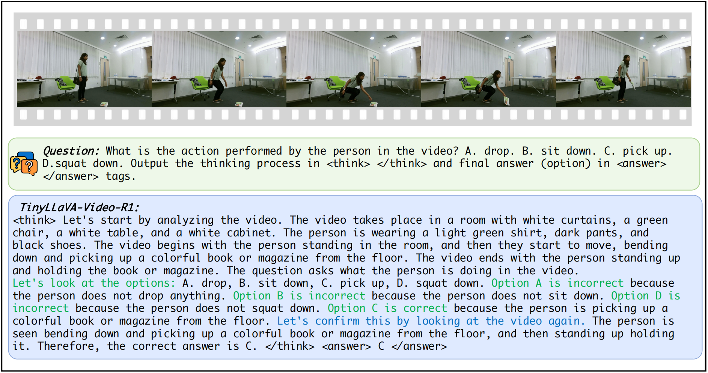
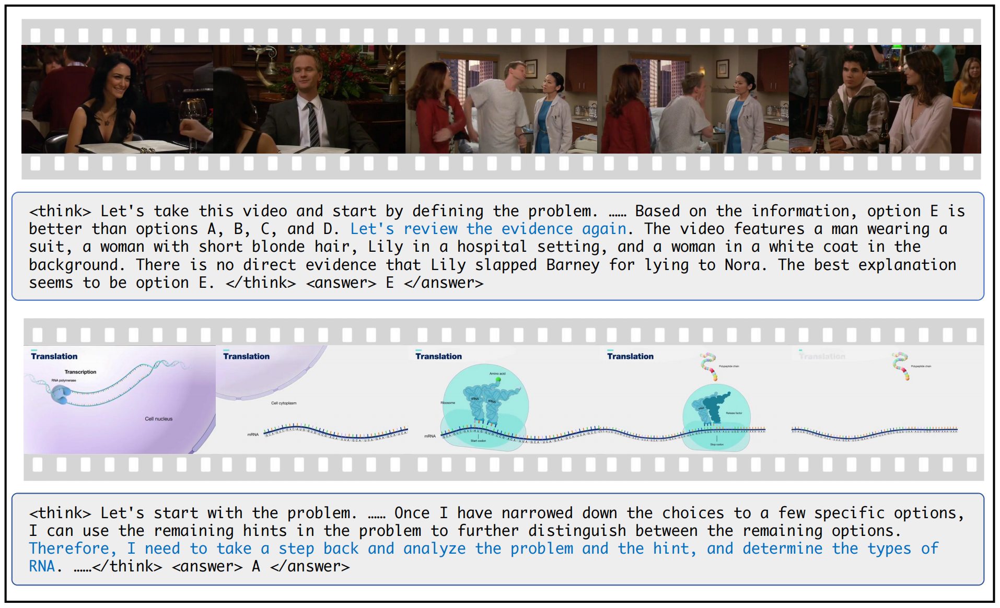

<h2 align="center">HBLLaVA
</a>

<h5 align="center">
<div align="center">


</div>

<div align="center">


</div>

## 📰 News

<div align="center">

</div>

## 🛠️ Installation

1. Clone this repository and navigate to the folder
```bash
git clone https://github.com/Hongbo-Jin/HBLLaVA.git
cd HBLLaVA
```

2. Create a conda environment, activate it and install Packages
```Shell
conda create -n hbllava python=3.10 -y
conda activate hbllava
pip install --upgrade pip  # enable PEP 660 support
pip install -e .
```

3. Install additional packages
```Shell
pip install flash-attn==2.7.3 --no-build-isolation
```
##### Upgrade to the latest code base

```Shell
git pull
pip install -e .
```

## 📌 Usage

### Trained Model


### 1. Data Preparation
We select multiple choice questions from the NextQA subset of [LLaVA-Video-178K](https://huggingface.co/datasets/lmms-lab/LLaVA-Video-178K) as training data. To maintain manageable training time with limited computational resources, we only choose the subset of data with a duration of 0 to 30 seconds, which contains 5,496 samples. The training data can be downloaded from [here](https://huggingface.co/datasets/Zhang199/TinyLLaVA-Video-R1-training-data).

#### Organize Data

Organize the files and annotation files as follows in ``path/to/your/dataset``:

```Shell
dataset
├── NextQA
│   ├── NExTVideo
├── nextqa_0-30s.jsonl
├── nextqa-coldstart-16.json
```

### 2. Train

#### 1. Cold Start

**Option1**: You can directly download [TinyLLaVA-Video-ColdStart](https://huggingface.co/Zhang199/TinyLLaVA-Video-Coldstart_NextQA_16).

**Option2**: You can train the model yourself: 

Replace data paths and model paths with yours in `scripts/train/train_qwen2_coldstart.sh`

```bash
bash scripts/train/train_qwen2_coldstart.sh
```

#### 2. GRPO Training

Replace data paths and output_dir with yours in `scripts/train/train_qwen2_reason_nextqa.sh`

```bash
bash scripts/train/train_qwen2_reason_nextqa.sh
```

### 3. Evaluation

We currently provide evaluations on 4 benchmarks, including [Video-MME](https://video-mme.github.io/home_page.html#leaderboard), [MVBench](https://huggingface.co/datasets/OpenGVLab/MVBench), [MLVU](https://github.com/JUNJIE99/MLVU), [MMVU](https://github.com/yale-nlp/MMVU).

#### Video-MME

1. Download [Video-MME](https://huggingface.co/datasets/lmms-lab/Video-MME) and put it under ``path/to/your/dataset/eval/Video-MME``.
2. Please change ``MODEL_PATH``, ``MODEL_NAME``, ``EVAL_DIR``, ``conv-mode`` and ``duration`` in ``scripts/eval/videomme.sh``. There are three types of ``duration`` available for testing: ``short``, ``medium``, and ``long``.
3. Please use the following command for single-gpu inference.
   ```bash
   CUDA_VISIBLE_DEVICES=0 bash scripts/eval/videomme.sh
   ```

#### MVBench

1. Download [MVBench](https://huggingface.co/datasets/OpenGVLab/MVBench) and put it under ``path/to/your/dataset/eval/MVBench``.
2. Please change ``MODEL_PATH``, ``MODEL_NAME``, ``EVAL_DIR`` and ``conv-mode`` in ``scripts/eval/mvbench.sh``.
3. Please use the following command for single-gpu inference.
   ```bash
   CUDA_VISIBLE_DEVICES=0 bash scripts/eval/mvbench.sh
   ```

#### MLVU

1. Download [MLVU](https://huggingface.co/datasets/MLVU/MVLU) and put it under ``path/to/your/dataset/eval/MLVU``.
2. Please change ``MODEL_PATH``, ``MODEL_NAME``, ``EVAL_DIR`` and ``conv-mode`` in ``scripts/eval/mlvu.sh``.
3. Please use the following command for single-gpu inference.
   ```bash
   CUDA_VISIBLE_DEVICES=0 bash scripts/eval/mlvu.sh
   ```

#### MMVU

1. Download [MMVU](https://huggingface.co/datasets/yale-nlp/MMVU) and put it under ``path/to/your/dataset/eval/MMVU``.
2. Please change ``MODEL_PATH``, ``MODEL_NAME``, ``EVAL_DIR`` and ``conv-mode`` in ``scripts/eval/mmvu.sh``.
3. Please use the following command for single-gpu inference.
   ```bash
   CUDA_VISIBLE_DEVICES=0 bash scripts/eval/mmvu.sh

### Quick Inference Scripts

1. Please change ``model_path``, ``prompt`` and ``video_file`` in ``eval.py``.
2.  Please use the following command for single-gpu inference.
   ```bash
   CUDA_VISIBLE_DEVICES=0 python eval.py
   ```

## 📊 Results


The performance of **TinyLLaVA-Video-R1** is significantly higher than TinyLLaVA-Video-ColdStart, especially in benchmarks that test reasoning abilities such as MMVU. Moreover, it outperforms TinyLLaVA-Video-SFT across all benchmarks, highlighting the effectiveness of the reinforcement learning approach employed.

##  Aha Moment 

**TinyLLaVA-Video-R1** exhibits "aha moments" where it revisits and refines its initial reasoning. As shown in the image below, the model self-corrects by evaluating different options and improving its responses, which enhances accuracy and interpretability. This reflective behavior distinguishes it from traditional models, offering greater transparency in the reasoning process.

<div align="center">

</div>

## 📝 Citation

If you find our work interesting and helpful, please consider giving our repo a star. Additionally, if you would like to cite our work, please use the following format:
```bibtex

```

## 📨 Contact

If you have any questions or suggestions, please feel free to contact us at ``hongbo@hust.edu.cn``.

## ❤️ Community efforts
* This repository is based on [TinyLLaVA-Video](https://github.com/ZhangXJ199/TinyLLaVA-Video) project.
* The implementation of the GRPO algorithm refers to the [open-r1-multimodal](https://github.com/EvolvingLMMs-Lab/open-r1-multimodal) project. Great work!
